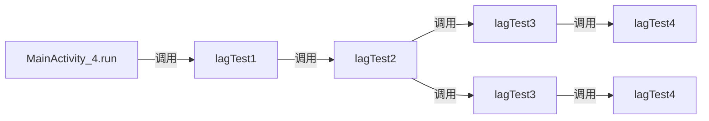

# AndroidUILagDetector

检测引起UI界面卡顿的耗时方法.

# 用法与用量
建议仅在开发环境接入, 用来调查UI卡顿问题. 不建议接入到生产环境.<br>
因为使用ASM会大量插入检测代码. 增大代码体积.

### 接入
cdt1.0.0.rar 中, repo 和 sktConfigs解压到工程root目录:
```
root\
  |- repo
  |- sktConfigs
  |- app  //app 工程

```
cdr1.0.0.aar 移动到 app/libs目录
```
root\
  |- repo
  |- sktConfigs
  |- app  //app 工程
      |- libs
          |- cdr1.0.0.aar  //aar文件

```

### Gradle接入
root/build.gradle

```gradle
buildscript {
    
    google()
    jcenter()
    
    //cdt repo
    repositories {
        maven {
            url uri('repo')  //添加本地仓库
        }
    }
}
dependencies {

    //cdt编译插件
    classpath 'com.yanzx.lib:skating_plugin:1.0.0'
}
```

app/build.gradle
```gradle

apply plugin: 'com.yanzx.lib'

dependencies {
    implementation fileTree(dir: "libs", include: ["*.jar", "*.aar"])  //添加aar依赖
}

```

### java代码

```java

        //初始化cdt
        HandlerThread ht = new HandlerThread("CDT_LOOPER");
        ht.start();

        //CDT需要一个后台线程的Looper, 用来处理耗时方法信息
        CDT.init(ht.getLooper());

        //设置报告生成的路径
        CDT.outputFilePath(
                getExternalFilesDir(null).getAbsolutePath()+"/LagReport.txt");

        //设置"报告"需要关注的包名, 耗时排行的报告将主要关注包名所在的类.
        CDT.addFilter("com.some.your.pkg.name");        //这里改成你自己的包名
        CDT.addFilter("com.some.your.other.pkg.name");  //或者其它你关注的包名. 

        //上面两行可以也直接写成这样. 匹配过程是 pkgName.startwith(xxx)
        CDT.addFilter("com.some.your");

        //以"TAG_onCreate"为Tag, 开始监听耗时方法
        CDT.startTrace("TAG_onCreate");

        //监听到某一帧超过 GData.LAG_TIME时, 触发回调
        CDT.setLagListener(new Skt.ILagListener() {
            @Override
            public boolean lagFrame(SktMethodNode lagFrame) {
                Log.e("CDT", "lagFrame");
                lagFrame.print();
                //lagFrame.printAndClear();
                Log.e("CDT", "lagFrame end");
                return true;
            }
        });
```

#### 帧率统计

```java

        //开始统计帧率
        CDT.startFpsCount();
        //.....
        //统计startFpsCount() 到 endFpsCount()之间, 这段时间的帧率数据, 输出到logcat
        CDT.endFpsCount();
```

帧率统计日志

```json5
//TAG_onStart标签下, 帧率91.1271fps. 一共38帧, 时长0.417ms
TAG_onStart_FPS:91.1271| frame:38| dur:0.417
```

```
//TAG_onStart标签下, 帧率90.12629fps. 一共38帧, 时长1.742ms
TAG_onStart_FPS:90.12629| frame:157| dur:1.742
```


### 日志输出&报告

```java
        //输出报告文件到CDT.outputFilePath()指定的路径
        CDT.outputLagToFile();
```

#### 日志格式:

```json5
TAG_onStart     500ms com.yanzx.lib.demo.SubClass(->SubClassClass2).paramThis(SubClass.java:5)
```

|字段|说明|
|-:|:-|
**TAG_onStart**| 就是CDT.startTrace("TAG_onStart")设置的标签, 会记录在这里
**500ms** |表示这个方法耗时500ms
**com.yanzx.lib.demo.SubClass** |表示方法paramThis()所在的类
**(->SubClassClass2)** |表示实际调用paramThis()的对象, 是SubClass的子类`SubClassClass2`
**(SubClass.java:5)**   |     方法paramThis()所在的代码位置

#### 调用堆栈关系

日志中会以缩进的方式表达调用关系:

```json5
  TAG_onStart   64ms com.yanzx.demo.MainActivity$4.run(4.java:121)
  TAG_onStart     64ms com.yanzx.lib.demo.LagExample.lagTest1(LagExample.java:71)
  TAG_onStart       64ms com.yanzx.lib.demo.LagExample.lagTest2(LagExample.java:74)
  TAG_onStart         32ms com.yanzx.lib.demo.LagExample.lagTest3(LagExample.java:78)
  TAG_onStart           32ms com.yanzx.lib.demo.LagExample.lagTest4(LagExample.java:82)
  TAG_onStart         32ms com.yanzx.lib.demo.LagExample.lagTest3(LagExample.java:78)
  TAG_onStart           32ms com.yanzx.lib.demo.LagExample.lagTest4(LagExample.java:82)
```

这个日志说明调用关系如下:



MainActivity$4.run() 调用了lagTest1(),<br>
lagTest1()调用了lagTest2(),<br>
lagTest2()调用了**两次**lagTest3(),<br>
lagTest3()调用了lagTest4()

通过日志甚至可以大致反推源代码:

```java
    public void lagTest1() {
        lagTest2(); //耗时64ms
    }
    public void lagTest2() {
        lagTest3(); //耗时32ms
        lagTest3(); //耗时32ms
    }
    public void lagTest3() {
        lagTest4();
    }

    public void lagTest4() {
        //耗时32ms
    }
```

#### 报告输出:

```json5
耗时帧排行Top10:
  //FrameCallback 表示一帧的起始点
     1305ms Choreographer.FrameCallback.doFrame(FrameCallback.java:-1)
  TAG_onCreate     1021ms com.yanzx.demo.MainActivity.onStart(MainActivity.java:105)
   
  TAG_onStart   985ms Choreographer.FrameCallback.doFrame(FrameCallback.java:-1)
  TAG_onStart     975ms com.yanzx.demo.MainActivity$5.run(5.java:129)
   
  TAG_onStart   304ms Choreographer.FrameCallback.doFrame(FrameCallback.java:-1)
  TAG_onStart     108ms com.yanzx.demo.MainActivity$3.run(3.java:114)
  TAG_onStart     64ms com.yanzx.demo.MainActivity$4.run(4.java:121)
   
耗时方法排行Top10:
  TAG_onStart   696ms com.yanzx.lib.demo.LagExample.throwTest3(LagExample.java:56)
  TAG_onStart   500ms com.yanzx.lib.demo.SubClass$SubClassClass2.paramThis2(SubClassClass2.java:31)
  TAG_onStart   224ms com.yanzx.lib.demo.LagExample.lagTest4(LagExample.java:82)
  TAG_onStart   140ms com.yanzx.lib.demo.LagExample.lagTest4(LagExample.java:82)
  TAG_onStart   103ms com.yanzx.lib.demo.LagExample.lagAndThrow4(LagExample.java:37)

耗时方法排行Top10:(包含系统/第三方)
  TAG_onStart   688ms com.yanzx.lib.demo.LagExample.throwTest3(LagExample.java:56)
  TAG_onStart   500ms com.yanzx.lib.demo.SubClass$SubClassClass2.paramThis2(SubClassClass2.java:31)
  TAG_onStart   219ms com.yanzx.lib.demo.LagExample.lagTest4(LagExample.java:82)
  TAG_onStart   145ms com.yanzx.lib.demo.LagExample.lagTest4(LagExample.java:82)
  TAG_onStart   100ms com.yanzx.lib.demo.LagExample.lagAndThrow4(LagExample.java:37)

耗时方法调用次数排行Top10:
  cnt:3  |TAG_onStart   219ms com.yanzx.lib.demo.LagExample.lagTest4(LagExample.java:82)
  cnt:2  |TAG_onStart   500ms com.yanzx.lib.demo.SubClass$SubClassClass2.paramThis2(SubClassClass2.java:31)
  cnt:2  |TAG_onStart   100ms com.yanzx.lib.demo.LagExample.lagAndThrow4(LagExample.java:37)
  cnt:1  |TAG_onStart   219ms com.yanzx.lib.demo.LagExample.lagTest4(LagExample.java:82)
  cnt:1  |TAG_onStart   688ms com.yanzx.lib.demo.LagExample.throwTest3(LagExample.java:56)

耗时方法精简堆栈:
  TAG_onCreate   1021ms com.yanzx.demo.MainActivity.onStart(MainActivity.java:105)
  TAG_onStart     21ms com.yanzx.lib.demo.LagExample.funLag(LagExample.java:17)
  TAG_onStart     500ms com.yanzx.lib.demo.SubClass(->SubClassClass2).paramThis(SubClass.java:5)
  TAG_onStart       500ms com.yanzx.lib.demo.SubClass$SubClassClass2.paramThis2(SubClassClass2.java:31)
  TAG_onStart     500ms com.yanzx.lib.demo.SubClass.paramThis3(SubClass.java:13)
   
  TAG_onStart   975ms com.yanzx.demo.MainActivity$5.run(5.java:129)
  TAG_onStart     287ms com.yanzx.lib.demo.LagExample.lagTest1(LagExample.java:71)
  TAG_onStart       287ms com.yanzx.lib.demo.LagExample.lagTest2(LagExample.java:74)
  TAG_onStart         145ms com.yanzx.lib.demo.LagExample.lagTest3(LagExample.java:78)
  TAG_onStart           145ms com.yanzx.lib.demo.LagExample.lagTest4(LagExample.java:82)
  TAG_onStart         142ms com.yanzx.lib.demo.LagExample.lagTest3(LagExample.java:78)
  TAG_onStart           142ms com.yanzx.lib.demo.LagExample.lagTest4(LagExample.java:82)
  TAG_onStart     688ms com.yanzx.lib.demo.LagExample.throwTest(LagExample.java:48)
  TAG_onStart       688ms com.yanzx.lib.demo.LagExample.throwTest2(LagExample.java:52)
  TAG_onStart         688ms com.yanzx.lib.demo.LagExample.throwTest3(LagExample.java:56)
  TAG_onStart           688ms com.yanzx.lib.demo.LagExample.throwTest4(LagExample.java:60)
  TAG_onStart             444ms com.yanzx.lib.demo.LagExample.lagTest1(LagExample.java:71)
  TAG_onStart               444ms com.yanzx.lib.demo.LagExample.lagTest2(LagExample.java:74)
  TAG_onStart                 219ms com.yanzx.lib.demo.LagExample.lagTest3(LagExample.java:78)
  TAG_onStart                   219ms com.yanzx.lib.demo.LagExample.lagTest4(LagExample.java:82)
  TAG_onStart                 225ms com.yanzx.lib.demo.LagExample.lagTest3(LagExample.java:78)
  TAG_onStart                   225ms com.yanzx.lib.demo.LagExample.lagTest4(LagExample.java:82)
  TAG_onStart             102ms com.yanzx.lib.demo.LagExample.lagAndThrow(LagExample.java:25)
  TAG_onStart               101ms com.yanzx.lib.demo.LagExample.lagAndThrow2(LagExample.java:29)
  TAG_onStart                 100ms com.yanzx.lib.demo.LagExample.lagAndThrow3(LagExample.java:33)
  TAG_onStart                   100ms com.yanzx.lib.demo.LagExample.lagAndThrow4(LagExample.java:37)
   
  TAG_onStart   108ms com.yanzx.demo.MainActivity$3.run(3.java:114)
  TAG_onStart     108ms com.yanzx.lib.demo.LagExample.lagTest1(LagExample.java:71)
  TAG_onStart       108ms com.yanzx.lib.demo.LagExample.lagTest2(LagExample.java:74)
  TAG_onStart         54ms com.yanzx.lib.demo.LagExample.lagTest3(LagExample.java:78)
  TAG_onStart           54ms com.yanzx.lib.demo.LagExample.lagTest4(LagExample.java:82)
  TAG_onStart         54ms com.yanzx.lib.demo.LagExample.lagTest3(LagExample.java:78)
  TAG_onStart           54ms com.yanzx.lib.demo.LagExample.lagTest4(LagExample.java:82)
   
  TAG_onStart   64ms com.yanzx.demo.MainActivity$4.run(4.java:121)
  TAG_onStart     64ms com.yanzx.lib.demo.LagExample.lagTest1(LagExample.java:71)
  TAG_onStart       64ms com.yanzx.lib.demo.LagExample.lagTest2(LagExample.java:74)
  TAG_onStart         32ms com.yanzx.lib.demo.LagExample.lagTest3(LagExample.java:78)
  TAG_onStart           32ms com.yanzx.lib.demo.LagExample.lagTest4(LagExample.java:82)
  TAG_onStart         32ms com.yanzx.lib.demo.LagExample.lagTest3(LagExample.java:78)
  TAG_onStart           32ms com.yanzx.lib.demo.LagExample.lagTest4(LagExample.java:82)
   

各标签内耗时方法个数:
TAG_onStart: LAG_CNT: 21
TAG_onCreate: LAG_CNT: 0
```

### 其它配置:
在工程目录root/sktConfigs/文件夹下, 可放置如下配置文件:

**configs.json**. CDT的调式标记. "debug": true时会打印更多更完整的信息
```json
{
    "debug": true
}
```

**skt_skip_annotation.txt**. CDT会忽略文件中注解标识的注解. 每一行一个注解.
```json5
androidx.annotation.RestrictTo
```

**skt_skip_class.txt**. CDT会忽略文件中注解标识的类或者包. 每一行代表一个类或者包, 以className.startWith(xxx)方式匹配
```json5
androidx
```
